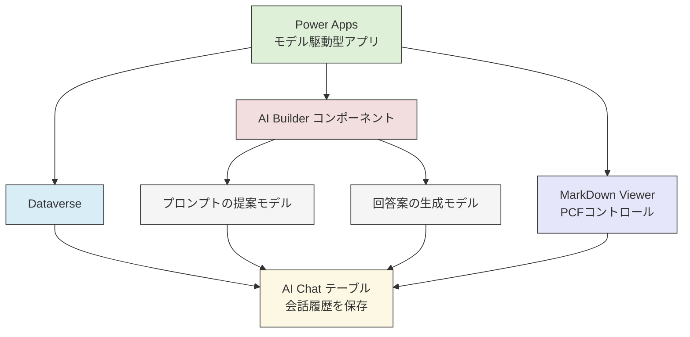

# ChatUI
Power Apps モデル駆動型アプリで動作する Chat UI のカスタムページです。 Copilot Studio で作成するエージェントではなく、AI Builder 及び Power Apps 、 PCF コントロールであえて構成されています。

## 概要
本アプリは、Power Apps のモデル駆動型アプリ、Microsoft Dataverse、AI Builder を組み合わせて構築される、会話支援および履歴管理の機能を持つアプリケーションです。以下の要素で構成されています。

あえて Power Apps で作成することにより、チャット内にコピーのコントロールを配置したり、一部を拡大したり、プロンプトの提案を動的に出力させたりするような柔軟な画面上のカスタマイズを Power Apps の知識で行うことができます。

https://github.com/user-attachments/assets/61521ce0-87df-4521-802d-9a70380bc260

## 機能
以下の構成要素が含まれています。

* Power Apps モデル駆動型アプリ: アプリ UI を提供。
* AI Builder に接続される 2 種類のモデル：
    * プロンプトの提案モデル（ユーザー入力に応じた質問生成）
    * 回答案の生成モデル（ユーザーの質問に対する回答生成）
* Chat テーブル は 会話履歴の保存 に使用される
 

### 1. モデル駆動型アプリ（Power Apps）
ユーザーは Power Apps 上のモデル駆動型アプリを通じて、チャット履歴の参照や、AI による質問や回答の管理を行います。UI は Dataverse 上のテーブル構造に基づいて自動的に生成され、効率的な開発が可能です。

### 2. Dataverse と AI Chat テーブル
Dataverse はアプリケーションの中核となるデータプラットフォームであり、チャットの履歴データはカスタムテーブルである「AI Chat テーブル」に保存されます。このテーブルには、ユーザーの入力や AI の応答、生成された提案やメタ情報など、会話の履歴が時系列で格納されます。

### 3. AI Builder（AI モデル連携）
AI Builder を用いることで、アプリに以下の 2 種類の生成 AI モデルが統合されます：

#### プロンプトの提案モデル
ユーザーの入力に基づき、適切な質問や対話の方向性を提示するための候補プロンプトを生成します。

#### 回答案の生成モデル
提案された質問やユーザーの入力に対して、自然な応答や関連する情報を生成します。

これらの AI モデルは、Power Apps から呼び出され、生成されたプロンプトや回答は Dataverse の AI Chat テーブルに保存され、ユーザーに提示されます。

以下は、**Power Apps モデル駆動型アプリ**を使用するための**前提条件**および**インポート方法**のうち、「環境での PCF（Power Apps Component Framework）の有効化」が含まれた最新の記述です。

---

## 前提条件

本アプリを利用・インポートするためには、以下の前提条件を満たしている必要があります。

1. **Power Apps ライセンス**
   -  **Power Apps Premium** ライセンスが必要です。

2. **AI Builder ライセンス**
   - 生成 AI を含む AI Builder モデルを使用するには、**AI Builder 容量**が含まれるライセンスが必要です。

3. **Dataverse 環境の要件**
   - 環境で **[Power Apps Component Framework (PCF)](https://learn.microsoft.com/ja-jp/power-apps/developer/component-framework/custom-controls-overview)** の使用が有効化されていること。
     - Power Platform 管理センターで「機能設定」から `Power Apps component framework` をオンにする必要があります。

---

## インポート方法

1. **ソリューションファイルの準備**
   - `.zip` 形式の [Power Apps ソリューションファイルを取得](https://github.com/geekfujiwara/ChatUI/releases/tag/ChatUI)します（Dataverse テーブル、モデル駆動型アプリ、PCF コンポーネント、AI Builder 設定などを含む）。

2. **MarkDown PCF コンポーネントのダウンロード**
   - [マークダウンを表示するPCFコンポーネントをダウンロード](https://github.com/megel/PCF-MarkDownViewer/releases/download/v1.5.0/Mark_Down_Viewer_managed_1.5.zip)します。

3. **ソリューションのインポート**
   - Power Apps ポータル（https://make.powerapps.com）にアクセス。
   - 対象の環境を選択し、「ソリューション」 > 「インポート」から 先にマークダウンのソリューションの `.zip` ファイルをアップロードしてインポートします。
   - インポートが完了したら、続けて本ソリューションをインポートします。

4. **すべてのカスタマイズの公開**
   - ソリューションを選択し、すべてのカスタマイズの公開を行います。

以上

